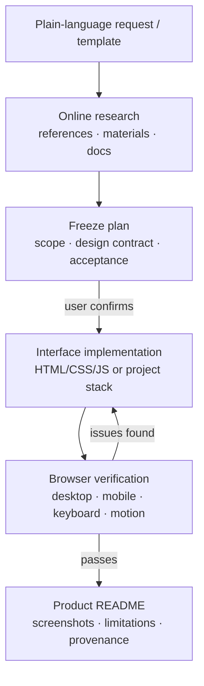

<div align="center">


# UI Design Agent Kit

English | [简体中文](README.md)

### A project-level AI design workflow: from plain-language requests to verifiable interfaces.

**Intake · Material research · Confirmed design · Implementation · Browser-verified acceptance.**

This is not a standalone AI client, and not an application scaffold.

<br />

[](https://github.com/muzimu217/ui-design-agent-kit/stargazers)
[](https://github.com/muzimu217/ui-design-agent-kit/issues)
[](https://doi.org/10.5281/zenodo.22804947)
[](#license)
[](package.json)
[](#verification)

**[Quick start](#quick-start)** ·
[Online showcase](https://agent.kcos.club/) ·
[Product cases](#product-cases) ·
[Usage](docs/usage.md) ·
[Paper (DOI)](https://doi.org/10.5281/zenodo.22804947)

<br />


<sub>A showcase of workflow outcomes: collected cases, entry points, and verification records. It is not a runnable AI client.</sub>

<br />

<video src="showcase/products/media/intro.mp4" controls muted loop playsInline preload="metadata"></video>

<sub>20-second intro video, rendered by the Remotion pipeline in this repository.</sub>

</div>

---

> [!IMPORTANT]
> **This repository maintains a UI-specialist agent, not a product runtime.**
>
> `demo/` and the showcase are explicitly accepted teaching and acceptance cases.
> Case screenshots prove the result of that page's check on that day; they do not
> mean every generated task passed acceptance. The kit provides no model service,
> accounts, paid assets, or backend integrations.

## Why this exists

Most UI generation mixes requirements, design decisions, and acceptance evidence
in one chat transcript.

UI Design Agent Kit splits them into confirmable steps:

<table>
<tr>
<td width="50%" valign="top">

### 🧭 From plain speech to an executable brief

A sentence in everyday language becomes a requirement summary, a first-version
scope, key questions, and a complete development prompt.

Implementation starts only after the user confirms the goal.

</td>
<td width="50%" valign="top">

### 🔍 Materials with provenance

References, official docs, asset libraries, and shipped examples are searched
by purpose; candidates, usage locations, and license boundaries are recorded.

Unreachable or low-scored sources never silently enter implementation.

</td>
</tr>
<tr>
<td width="50%" valign="top">

### ✨ Design with a contract

Mission, semantic tokens, Do/Don't rules, motion parameters, and responsive
constraints are written down as a checkable contract.

An interface is not delivered as "a good feeling".

</td>
<td width="50%" valign="top">

### 🧪 Delivery with evidence

Real browser checks cover desktop, mobile, keyboard, error states, and
reduced motion.

Results, known issues, and limitations go into the product README instead of
staying in code.

</td>
</tr>
</table>

---

## Research context

The methodology behind this kit — six human-confirmation gates, a five-level
evidence ladder, and a gate ledger for "AI Definition of Done" — is documented
in a systems paper:

**DOI [10.5281/zenodo.22804947](https://doi.org/10.5281/zenodo.22804947)** ·
source in [`paper/`](paper/) · citation file [`citation.cff`](citation.cff).

The behavior-evaluation corpus ([`evals/scenarios.json`](evals/scenarios.json))
covers product types, motion parameters, unavailable tools, reduced motion,
long lists, and video timelines. Executions are recorded per scenario with
browser evidence in [`evals/runs/`](evals/runs/); the latest batch report —
including the defects real execution caught and how they were fixed — is in
[`docs/eval-report-2026-09.md`](docs/eval-report-2026-09.md).

---

## From one sentence to an accepted interface

1. **Describe the need** — product, users, core flow, constraints in plain
   language; an optional fill-in template helps.
2. **Research online** — similar products, official docs, asset sources, and
   interface references; direction first, code later.
3. **Freeze the plan** — information architecture, visual direction, component
   list, motion rules, stack, and acceptance method, then wait for confirmation.
4. **Implement and check** — build to the contract, capture browser screenshots,
   fix P0/P1 issues, keep the evidence.
5. **Write the product README** — features, screenshots, run steps, limitations,
   material provenance, and verification results.

In an AI session with this kit installed:

```text
$ui-design-agent I want one place to track purchase requests my colleagues
have filed in chat, and see who hasn't been handled. Draft the first-version
requirements, research references yourself, and give me the full development
prompt — don't build anything yet.
```

---

## More than a generated screen

<table>
<tr>
<td width="50%">


<p align="center"><sub>Inventory console: list, details, demo data</sub></p>

</td>
<td width="50%">


<p align="center"><sub>Tempo today rhythm: tasks and focus timer</sub></p>

</td>
</tr>
<tr>
<td width="50%">


<p align="center"><sub>Brick workshop: free 3D building and challenges</sub></p>

</td>
<td width="50%">


<p align="center"><sub>NODEGRID: fictional cloud-node network visualization</sub></p>

</td>
</tr>
</table>

<p align="center">
<a href="showcase/products/README.md"><strong>All product cases →</strong></a>
</p>

---

## Product cases

| Product | Type | Docs |
| --- | --- | --- |
| Inventory console | Inventory list & details, demo data | [view](demo/inventory-console/README.md) |
| Tempo today rhythm | Local task management & focus timer | [view](demo/tempo-day/README.md) |
| Brick workshop | Free 3D building & challenges | [view](demo/brick-workshop/README.md) |
| NODEGRID | Fictional cloud-node network visualization | [view](demo/nodegrid/README.md) |
| Subway runner ("地铁疾行") | Three-lane 3D runner | [view](demo/subway-runner/README.md) |
| FORMA One | Fictional phone configurator demo | [view](demo/forma-phone-ui/README.md) |
| RuiEar 睿耳 | AI-earbuds concept page, 3D color switch | [view](demo/ruiear/README.md) |
| Obsidian 12 Pro（曜石 12 Pro） | Dual-model configurator & intent list | [view](demo/phone-demo/README.md) |
| Aurelis X1（曜时 X1） | Fictional smartwatch showcase | [view](demo/product-demo/README.md) |
| 一舟札记 | Fictional author & reading demo | [view](demo/blog-demo/README.md) |
| 竹与墨 (Zhu-Mo) | Ink-style tech blog demo | [view](demo/zhumu-blog/README.md) |
| AURELIS M2 | Early watch material & dial concept | [view](showcase/README.md) |

Generated products live in workspaces outside the repository by default; only
explicitly accepted cases are kept here. The repo root does not import product
runtime code.

---

## Prompt entry points

| File | Purpose |
| --- | --- |
| [Main prompt](.agents/skills/ui-design-agent/SKILL.md) | Role, design principles, stack, tool routing, delivery standard |
| [Plain-language intake template](.agents/skills/ui-design-agent/references/plan-execute.md#initial-request-template) | Fill-in request template and the development-prompt template |
| [Tool routing](.agents/skills/ui-design-agent/references/tool-routing.md) | Capability probing, candidate tools, permission boundaries, fallbacks |
| [Design contract](.agents/skills/ui-design-agent/references/design-contract.md) | Mission, semantic tokens, Do/Don't rules, quality gates |
| [Motion contract](.agents/skills/ui-design-agent/references/motion-contract.md) | Spring parameters, stagger, hover/press, reduced motion, interruption |
| [Plan/execute modes](.agents/skills/ui-design-agent/references/plan-execute.md) | Freeze plan → user confirmation → code execution |
| [Detail-critique loop](.agents/skills/ui-design-agent/references/detail-critique.md) | Per-component critique, severity triage, unfixed-issue ledger |
| [3D & media workflow](.agents/skills/ui-design-agent/references/spatial-media.md) | Live scenes, physics, Blender assets, web video, pixel acceptance |
| [Remotion prompt](.agents/skills/remotion-video-agent/SKILL.md) | Video frame timelines, transitions, Studio, render acceptance |

To migrate to another agent host, build the single-file prompt:

```bash
npm ci --ignore-scripts
npm run prompt:build
```

Output: `output/ui-design-agent.system.md`. Importing the prompt alone does not
install MCP servers or skills for another platform; the target host still needs
real tools, and the prompt's documented fallbacks apply when they are missing.

---

## Workflow architecture



---

## Quick start

Requires Node.js 20.18.1+, npm, and an AI host that can read project
instructions and skills.

```bash
git clone git@github.com:muzimu217/ui-design-agent-kit.git
cd ui-design-agent-kit

npm ci --ignore-scripts
npm run verify
npm test
```

Then describe a need in the session. Network, browser, and image-generation
capabilities depend on the host's actual tools; installing instructions does
not grant them.

---

## Verification

Run in order; do not run `npm ci` and tests concurrently:

```bash
npm run verify
npm test
npm run doctor
npm run doctor:mcp
```

`doctor` checks local configuration only. `doctor:mcp` contacts public
services and starts configured local MCP servers for read-only smoke checks;
it never signs into paid services. Passing it does **not** prove any real
application passed visual acceptance.

---

## License

This repository is maintained as an internal tool. It does not claim the
Remotion skill artifacts are freely redistributable under MIT. Upstream
licensing must be confirmed before any release; see
[`tooling/sources.lock.json`](tooling/sources.lock.json) and
[`THIRD_PARTY_NOTICES.md`](THIRD_PARTY_NOTICES.md).

---

<div align="center">

### Start from plain speech. Deliver the interface and its evidence together.

**[Quick start](#quick-start)**

<sub>Intake · Design · Implementation · Acceptance</sub>

</div>
