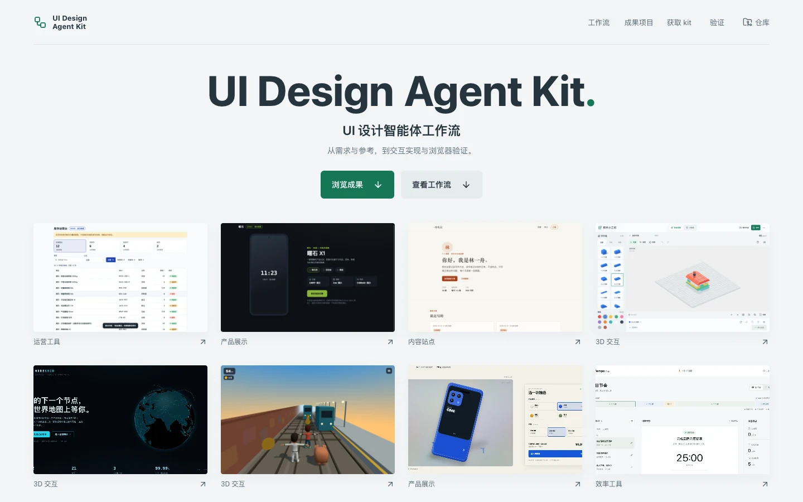
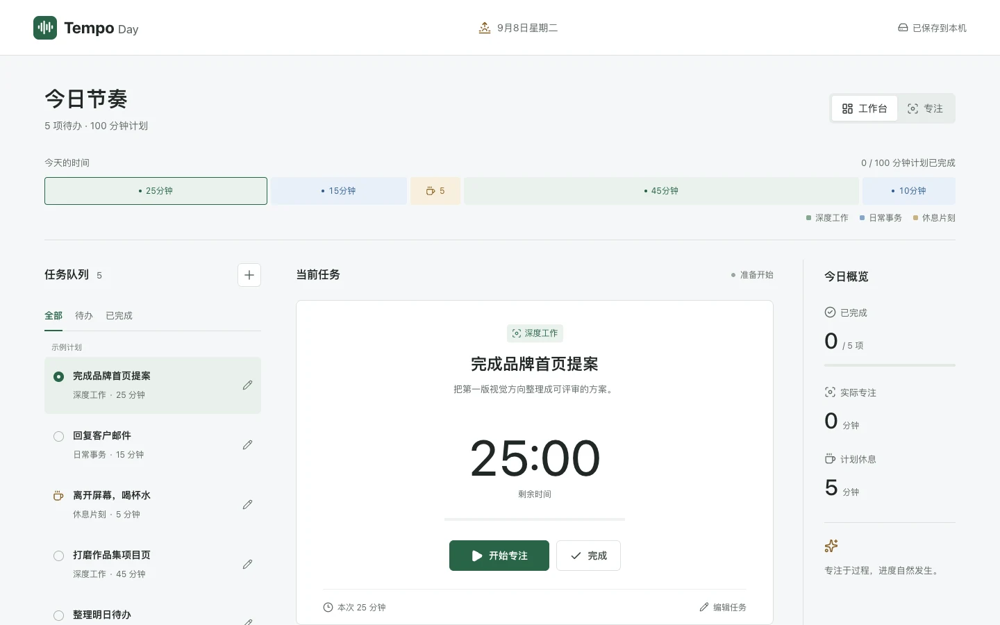
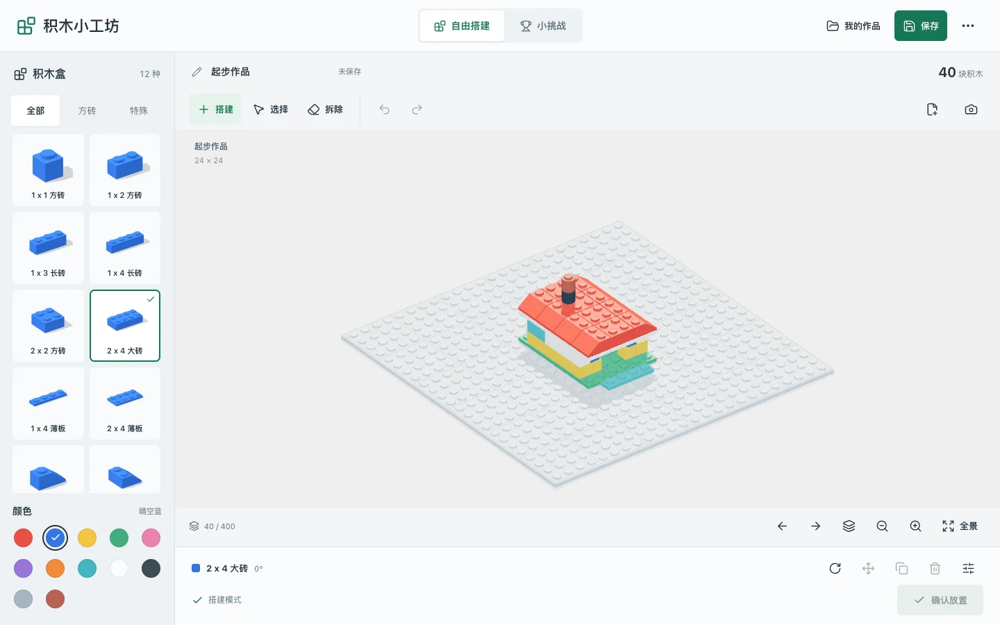
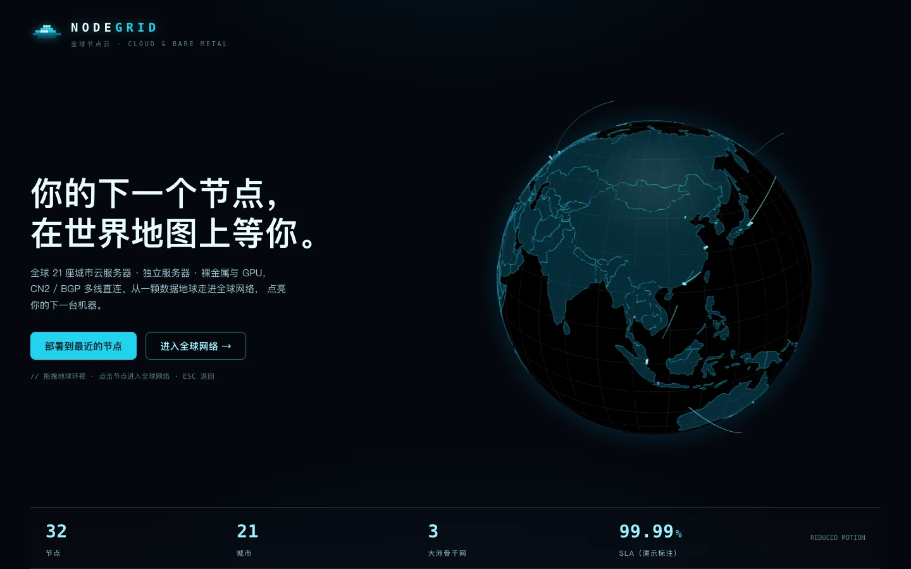
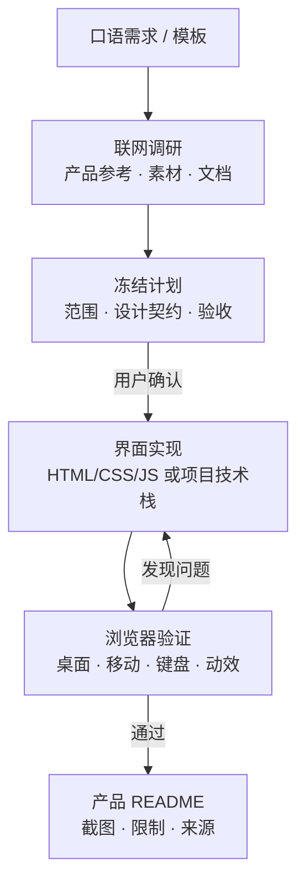

<div align="center">


# UI Design Agent Kit

### 从口语需求到可验证界面的项目级 AI 设计工作流。

**整理需求 · 查找素材 · 确认设计 · 实现交互 · 浏览器验收。**

这不是独立 AI 客户端，也不是应用脚手架。

<br />

[](https://github.com/muzimu217/ui-design-agent-kit/stargazers)
[](https://github.com/muzimu217/ui-design-agent-kit/issues)
[](#许可)
[](package.json)
[](#验证)

**[快速开始](#快速开始)** ·
[线上展厅](https://agent.kcos.club/) ·
[产品案例](#产品案例) ·
[使用说明](docs/usage.md) ·
[交付标准](.agents/skills/ui-design-agent/references/product-readme.md)

<br />



<sub>工作流成果展厅：展示已收录案例、入口与验证记录，不充当可执行 AI 客户端。</sub>

<br />

<video src="showcase/products/media/intro.mp4" controls muted loop playsInline preload="metadata"></video>

<sub>产品介绍视频（20 秒）：由仓库 <code>intro-video/</code> 的 Remotion 管线渲染，先学最好的界面，再交付有证据的产品。</sub>

</div>

---

> [!IMPORTANT]
> **这个仓库维护的是 UI 专业智能体，不是产品运行时。**
>
> demo 与 showcase 是已明确收录的教学与验收案例。案例截图证明对应页面的当次检查结果，不代表所有生成任务都已通过验收；主工具包不提供模型服务、账户、付费素材或后台业务接口。

## 为什么需要它

大多数 UI 生成把需求、设计决策和验收证据混在一段对话里。

UI Design Agent Kit 把它们拆成可确认的流程：

<table>
<tr>
<td width="50%" valign="top">

### 🧭 从口语到可执行方案

把一句日常描述整理成需求摘要、第一版范围、关键问题和完整开发提示词。

用户确认目标后，再进入实现阶段。

</td>
<td width="50%" valign="top">

### 🔍 素材有证据

按用途检索官网、文档、素材库和参考案例，记录候选来源、使用位置和授权边界。

不可达、低分或未验证的来源不会自动进入实现。

</td>
</tr>

<tr>
<td width="50%" valign="top">

### ✨ 设计有契约

把 Mission、语义 token、Do/Don't 规则、动效参数和响应式约束写成可检查契约。

界面不是只交一段好看的感觉。

</td>
<td width="50%" valign="top">

### 🧪 交付有证据

用真实浏览器检查桌面、移动、键盘、错误态和减少动效模式。

结果、已知问题和限制写入产品 README，而不是只留下代码。

</td>
</tr>
</table>

---

## 从一句话到可验收界面

1. **描述需求**
   用日常语言说明产品、用户、核心流程和限制；不确定的部分交给可填写模板。

2. **联网调研**
   查找相似产品、官方文档、素材来源和界面参考，先确认方向再动手。

3. **冻结计划**
   输出信息架构、视觉方向、组件清单、动效规则、技术栈和验收方法，等待确认。

4. **实现与检查**
   按契约实现界面，用浏览器采集截图，修复 P0/P1 问题并保留证据。

5. **写产品 README**
   记录功能、截图、运行方法、限制、素材来源和验证结果，让成果可被复用。

在本项目的 AI 对话中可以直接开始：

```text
$ui-design-agent 我想把采购申请集中起来，看谁还没处理。先整理第一版需求，由你联网找参考，再给我完整开发提示词，先不要开发。
```

不知道如何开头时，使用[可填写模板](.agents/skills/ui-design-agent/references/plan-execute.md#initial-request-template)。

---

## 不只是生成一屏 UI

<table>
<tr>
<td width="50%">


<p align="center"><sub>库存运营台：列表、详情和演示数据</sub></p>

</td>
<td width="50%">



<p align="center"><sub>Tempo 今日节奏：任务管理与专注计时</sub></p>

</td>
</tr>
<tr>
<td width="50%">



<p align="center"><sub>积木小工坊：3D 自由拼搭与小挑战</sub></p>

</td>
<td width="50%">



<p align="center"><sub>NODEGRID：虚构云节点网络可视化</sub></p>

</td>
</tr>
</table>

<p align="center">
<a href="showcase/products/README.md"><strong>查看全部产品案例 →</strong></a>
</p>

---

## 产品案例

每个产品 README 都独立记录自己的界面、运行方法和边界。

| 产品 | 类型 | 文档 |
| --- | --- | --- |
| 库存运营台 | 库存列表与详情，演示数据 | [查看](demo/inventory-console/README.md) |
| Tempo 今日节奏 | 本机任务管理与专注计时 | [查看](demo/tempo-day/README.md) |
| 积木小工坊 | 3D 自由拼搭与小挑战 | [查看](demo/brick-workshop/README.md) |
| NODEGRID | 虚构云节点网络可视化 | [查看](demo/nodegrid/README.md) |
| 地铁跑酷（展厅名：地铁疾行） | 三车道 3D 跑酷 | [查看](demo/subway-runner/README.md) |
| FORMA One | 虚构手机配置与购买路径演示 | [查看](demo/forma-phone-ui/README.md) |
| 曜石 12 Pro | 双机型配置与意向清单演示 | [查看](demo/phone-demo/README.md) |
| 曜时 X1 | 虚构智能腕表展示 | [查看](demo/product-demo/README.md) |
| 一舟札记 | 虚构作者与文章阅读演示 | [查看](demo/blog-demo/README.md) |
| 竹与墨 | 水墨风技术博客演示 | [查看](demo/zhumu-blog/README.md) |
| AURELIS M2 | 早期腕表材质与表盘概念 | [查看](showcase/README.md) |

生成的产品默认放在仓库外的独立工作区；这里只保留已明确收录的案例。根目录不导入产品运行代码。

---

## 提示词入口

| 文件 | 用途 |
| --- | --- |
| [主提示词](.agents/skills/ui-design-agent/SKILL.md) | 角色、设计原则、技术栈、工具路由、实现和交付标准 |
| [口语需求初始模板](.agents/skills/ui-design-agent/references/plan-execute.md#initial-request-template) | 可填写需求模板和联网调研后的开发提示词模板 |
| [工具路由](.agents/skills/ui-design-agent/references/tool-routing.md) | 实际能力探测、候选工具、权限边界和替代路径 |
| [设计契约](.agents/skills/ui-design-agent/references/design-contract.md) | Mission、语义 token、Do/Don't 规则与质量门 |
| [动效规则](.agents/skills/ui-design-agent/references/motion-contract.md) | 指定弹簧参数、级联、Hover/Press、减少动效与中断处理 |
| [计划/执行模式](.agents/skills/ui-design-agent/references/plan-execute.md) | 冻结计划、用户确认、再进入代码执行 |
| [细节批评内环](.agents/skills/ui-design-agent/references/detail-critique.md) | 逐组件评估、严重度分诊与未修复留痕 |
| [3D 与媒体工作流](.agents/skills/ui-design-agent/references/spatial-media.md) | 实时场景、物理引擎、Blender 资产、网页视频和像素验收 |
| [Remotion 提示词](.agents/skills/remotion-video-agent/SKILL.md) | 视频帧时间轴、转场、Studio 和渲染验收 |

需要迁移到其他智能体时，生成单文件提示词：

```bash
npm ci --ignore-scripts
npm run prompt:build
```

产物位于 `output/ui-design-agent.system.md`。单独导入提示词不会自动安装其他平台的 MCP 或 skills；目标环境仍需接入工具，缺失时按提示词中的替代流程执行。

---

## 工作流架构



主提示词保持单一维护源，视频流程由 Remotion 提示词承接，工具配置集中在 `.codex/config.toml`。

---

## 快速开始

需要 Node.js 20.18.1+、npm，以及能读取项目指令和技能的 AI 宿主。

```bash
git clone git@github.com:muzimu217/ui-design-agent-kit.git
cd ui-design-agent-kit

npm ci --ignore-scripts
npm run verify
npm test
```

然后在项目会话中描述需求。联网、浏览器和生图能力取决于当前宿主的实际工具，不因安装指令而自动获得。

---

## 验证

安装完成后依次运行，勿让 `npm ci` 与测试同时执行：

```bash
npm run verify
npm test
npm run doctor
npm run doctor:mcp
```

`doctor` 只检查本地配置；`doctor:mcp` 会访问公开服务并启动配置中的本地 MCP，进行只读调用，不登录付费服务。它不证明某个实际应用已通过视觉验收。

[评测场景](evals/scenarios.json)覆盖产品类型、动效参数、不可用工具、减少动效、长列表和视频转场。它们是可重复执行的行为评测规范；单元测试只检查结构，不代表已经逐场景运行了生成任务。

---

## 能力配置

| 能力 | 本项目配置 |
| --- | --- |
| Motion 官方文档、CSS 弹簧生成 | 已配置公开 MCP |
| Context7 文档检索 | 已配置公开 MCP |
| shadcn 组件检索 | 固定版本本地 MCP |
| Playwright 浏览器操作 | 固定版本、隔离无头会话 |
| UI UX Pro Max、Impeccable、Emil Design Eng、Animation Vocabulary、Pick UI Library、Baoyu Design | 已安装项目级 skill |
| Remotion | 6 个官方 skills + 本地视频编排提示词；不安装已废弃的官方 MCP |
| Three.js / R3F / Rapier | 按需运行库路由与验收规范；不在 kit 根目录安装运行库 |
| Blender 建模与 GLB 导出 | 可选本地 CLI / 第三方 Blender MCP 路由；未安装或配置 Blender MCP |
| Motion+、Figma | 配置已预留，默认关闭，未进行登录 |
| Google Stitch（UI 原型生成） | 可选 MCP，默认关闭；API key 走环境变量 `STITCH_API_KEY`，不内联；免费额度与调用结果需逐次验证 |

项目配置位于 `.codex/config.toml`，skill 位于 `.agents/skills`。没有改动全局模型、权限或 MCP 配置，也没有启用自动 hooks。

---

## 素材检索

素材检索遵循[候选排序规范](.agents/skills/ui-design-agent/references/material-scouting.md)：

1. **明确用途**：先确定素材在界面中的位置、尺寸、情感目标和授权边界。
2. **按优先级检索**：从官网、官方文档、开放素材库和高可信来源开始。
3. **少量候选**：保留足够比较的候选，而不是无边界堆链接。
4. **结构化评分**：把 MCP 或浏览器结果交给 `npm run material:rank -- --input <candidate-json>`。
5. **保留证据**：记录来源、访问时间、用途和风险；不可达或低分来源进入 secondary 区。

长期目标、五步迭代循环与定时任务机制见[目标与迭代机制](docs/goal.md)，逐轮记录见[迭代日志](docs/iteration-log.md)，思维链质量监控见[质量监控](docs/quality-monitor.md)。

---

## Contributing

Issues、bug 报告、功能建议、文档改进和 Pull Request 都欢迎。

较大改动建议先开 issue 对齐范围。修改仓库指令时，请从 [AGENTS.md](AGENTS.md) 和[主提示词](.agents/skills/ui-design-agent/SKILL.md)开始，避免创建第二份长系统提示词。

[报告问题](https://github.com/muzimu217/ui-design-agent-kit/issues/new/choose) ·
[查看开放 Issues](https://github.com/muzimu217/ui-design-agent-kit/issues)

---

## 社区

本项目已获得 [LINUX DO](https://linux.do) 社区收录与认可，感谢社区的支持与讨论。

[访问 LINUX DO 社区](https://linux.do)

---

## 许可

这个仓库当前作为内部工具维护，没有把 Remotion skills 的整套产物宣称为可自由再分发的 MIT 项目。发布前需确认上游授权；版本和修改记录见[来源锁定](tooling/sources.lock.json)与[第三方声明](THIRD_PARTY_NOTICES.md)。

---

<div align="center">

### 从口语需求开始。把界面和证据一起交付。

**[快速开始](#快速开始)**

<sub>需求 · 设计 · 实现 · 验收</sub>

</div>
