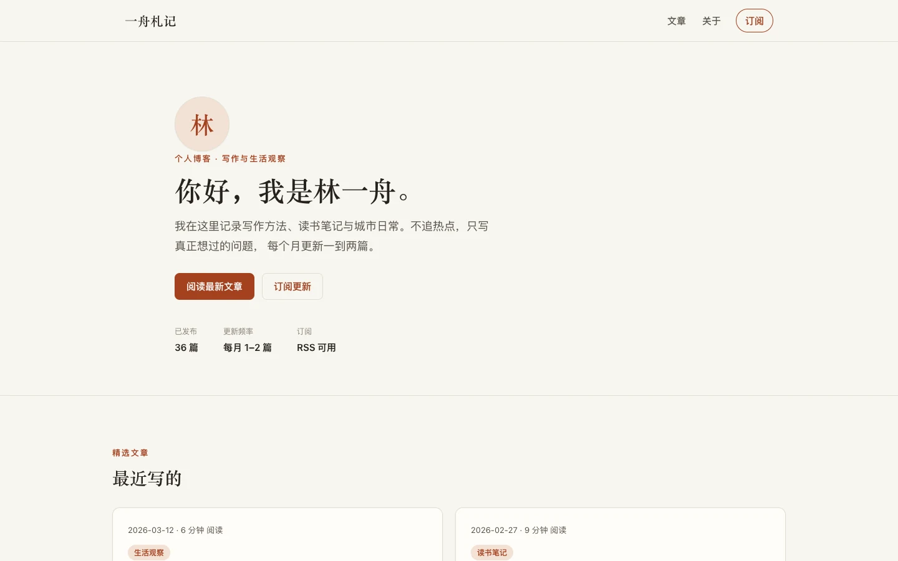

# 一舟札记

以作者介绍、文章浏览和订阅表单组成的个人博客界面演示。

[快速开始](#快速开始) · [可体验内容](#可体验内容) · [演示边界](#演示边界)



> 虚构博客。人物、文章、文章数量和更新频率均为示例，不是实际作者的发布记录。[截图记录](../../docs/readme-media.md)

## 可体验内容

- 从作者介绍进入文章列表和个人简介。
- 展开文章内容，查看标题、摘要、日期和阅读时间。
- 在订阅表单中输入邮箱，观察校验及成功状态。
- 使用页面导航和返回顶部入口。

## 快速开始

推荐 Node.js 24。在仓库根目录运行：

```bash
cd demo/blog-demo
npm ci --ignore-scripts
npm run dev -- --host 127.0.0.1 --port 5180
```

打开终端显示的地址，端口冲突时换一个端口。

## 演示边界

没有 CMS、文章编辑后台、账号或真实邮件订阅服务。订阅成功是前端状态反馈，不会发送邮件；页面中的 RSS 描述不代表已提供真实订阅源。请使用示例邮箱体验。

## 验证与维护

```bash
npm run build
```

构建包含类型检查。本项目未配置独立 `npm test`，不能将构建成功视为完整交互或无障碍验收。

[设计契约](DESIGN.md) · [历史验收](ACCEPTANCE.md) · [回放输入记录](replay.json)

反馈时提供展开的文章、输入状态、浏览器和复现步骤，不需要提交个人邮箱。

## 许可

未单独授予项目源码许可证；第三方依赖使用各自许可。参见[仓库第三方声明](../../THIRD_PARTY_NOTICES.md)。
