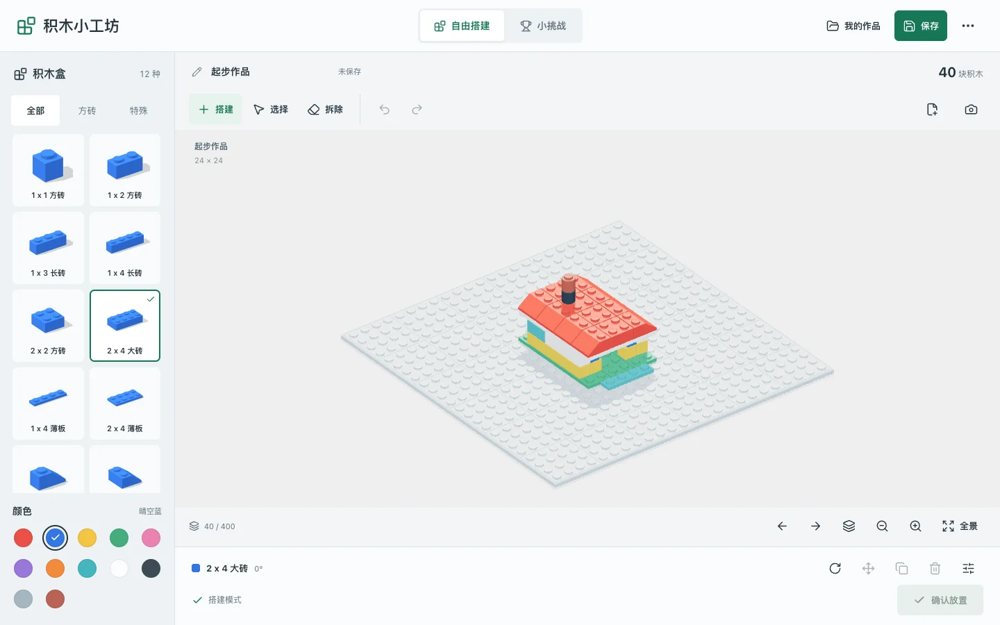

# 积木小工坊 Demo

由本仓库 UI Design Agent 工作流生成的 3D 拼搭实验，经用户明确要求收录为独立展示 demo。
这里保存可运行源码、依赖锁、规则测试和精选截图；不加入根 package.json 或 Agent 运行时。
原独立工作区仍保留，本目录为本次收录的维护入口。



## 本地运行

需要 Node 20.19+（20 系）、22.12+（22 系）或 24 及以上；发布工作流使用 Node 24。

```sh
cd demo/brick-workshop
npm ci --ignore-scripts
npm run dev -- --port 5174
```

```sh
npm test
npm run typecheck
npm run build
```

## 展示范围

- 12 种程序化积木、12 色；自由拼搭和三个小挑战。
- 移动、旋转、复制、改色、拆除、撤销和重做。
- 本机保存、JSON 导入导出、真实 PNG 截图。
- `?presentation=1` 为只读自动搭建展示，不读取或修改试玩存档。

24x24 底板，最高 36 板层，400 块上限。使用离散网格和支撑规则，不模拟真实结构承重。
斜坡与拱形采用保守包围占位。存档属于当前浏览器和访问地址，不上传服务器。

## 来源与证据

[来源说明](docs/SOURCES.md)记录模型、截图和依赖来源；程序化几何体及搭建结构为本项目生成。
[原始实验验收](docs/ACCEPTANCE.md)是入库前的历史记录，不代表新展示模式或 Pages 已上线。
本轮迁移、展示与部署验证见仓库的 `docs/product-showcase.md`。

[桌面](screenshots/desktop.webp) · [手机](screenshots/mobile.webp) ·
[小屋](screenshots/house.webp) · [火箭](screenshots/rocket.webp) · [城堡](screenshots/castle.webp)

这些图片是真实运行截图转为 WebP，不含原型参考网站素材或用户私有作品。
