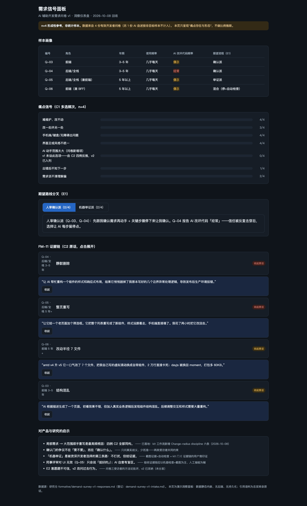

# 需求信号面板

把 4 份开发者问卷的真实发现做成可交互的洞察仪表盘：样本画像、痛点频次、期望路线分叉、FM-11 证据链与启示。

[快速开始](#本地运行) · [数据边界](#数据边界) · [验证范围](#验证范围)



> n=4 形成性参考，非统计样本。设计契约与门记录见 [DESIGN.md](DESIGN.md)，验收证据见 [ACCEPTANCE.md](ACCEPTANCE.md)。

## 能做什么

- 查看四位受访者的画像表（角色/年限/AI 改坏代码频率/期望路线）。
- 读痛点频次条形（C1 多选频次，n=4 计数如实标注）。
- 在"人审确认派 vs 机器举证派"两个期望路线间切换（键盘方向键/Home/End）。
- 逐条展开 FM-11 证据链的 C2 原话（Enter/点击展开，Esc 语义的收起按钮带焦点返回）。

## 数据边界

数据来源 = 研究仓 `formative/demand-survey-v1-responses.md`（4 份有效问卷 + 1 份非目标样本不计入）。**n=4 是形成性参考，不是统计样本**——页面显著标注，不做比例推断。引用语料为忠实转录原话，不改写。无后端、无持久化、无外部服务；数据静态内嵌于单口 `DATA` 常量（真实接入时替换为 fetch，四态语义不变）。

## 本地运行

纯静态单文件，任一静态服务即可：

```bash
cd demo/demand-insights
python3 -m http.server 4199 --bind 127.0.0.1
# 打开 http://127.0.0.1:4199/index.html
```

## 验证范围

桌面 1440×900 全页、移动 390×844（零横向溢出）、键盘链路 11 断言、对比度实测 10 对全过（4.5:1）、reduced-motion 动画关闭、console 零错误——明细与证据文件见 [ACCEPTANCE.md](ACCEPTANCE.md)。截图证明对应页面某次检查结果，不代表所有使用场景都已验收。
