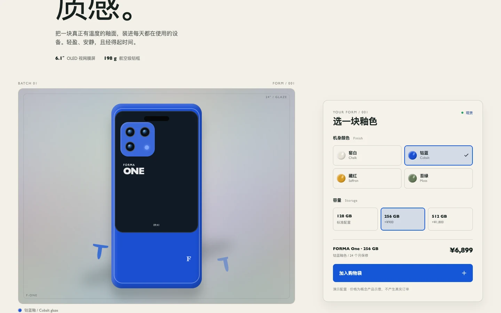

# FORMA One

将陶瓷釉色、容量和价格放在同一条配置路径里的虚构手机概念页。

[快速开始](#快速开始) · [交互范围](#交互范围) · [设计记录](#设计记录)



> 价格、规格、库存和购物袋均为概念演示数据，不产生真实订单。手机外观是 HTML/CSS 图形，不是实物照片。[截图记录](../../docs/readme-media.md)

本轮升级加入了 `motion/react` 的 spring、layoutId、AnimatePresence 和 whileInView 编排，并在产品窑架中嵌入本地 6 秒釉料流视频 `public/assets/forma-kiln-loop.mp4`。完整的触发、状态、参数、打断策略和 reduced-motion 约定见 [docs/motion-plan.md](./docs/motion-plan.md)。

## 快速开始

推荐 Node.js 24。在仓库根目录运行：

```bash
cd demo/forma-phone-ui
npm ci --ignore-scripts
npm run dev -- --host 127.0.0.1 --port 5186
```

打开终端显示的地址；端口被占用时换一个端口。

生产构建：

```bash
npm run build
```

## 交互范围

- 点击窑白、钴蓝、藏红或苔绿，产品背板和配方摘要同步更新。
- 点击 128 / 256 / 512 GB，价格实时变化。
- “加入购物袋”进入成功状态，支持“撤销”。
- 技术规格使用原生 `details/summary` 展开。
- 支持可见键盘焦点和 `prefers-reduced-motion`。

## 数据与限制

配置与购物袋反馈只存在于当前页面状态，没有账户、订单接口、支付或服务端持久化。窑变视频是本地演示媒体，不是制造过程证明。

## 设计记录

- [PRODUCT.md](./PRODUCT.md): 产品事实与边界
- [DESIGN.md](./DESIGN.md): 视觉设计契约
- [docs/surface-brief.md](./docs/surface-brief.md): 页面 brief
- [docs/direction-contract.md](./docs/direction-contract.md): concept-seed 方向与挑战者判定

## 验证

当前可执行检查是上面的 `npm run build`，包含 TypeScript 检查；未配置独立 `npm test`。
以下为此前实现回合留下的记录，不代表本次重新运行了完整验收；`artifacts/` 属于本地历史证据，不作为持久的 README 图片路径：

- `npm install`：通过，无漏洞报告。
- `npm run build`：通过，TypeScript 与 Vite 构建成功。
- Impeccable detector：`src/main.tsx`、`src/styles.css` 无机械警告。
- 浏览器：375、768、1024、1440px 均无横向溢出；颜色/容量/价格/购物袋交互已验证；键盘 Tab 顺序已验证；reduced-motion 已验证。
- Motion：正常模式下视频 `readyState=4` 且时间持续推进；选色/容量使用 layout spring，价格和购物袋使用 `AnimatePresence`；reduced-motion 下视频暂停、手机位移归零。
- 截图：`artifacts/forma-375.png`、`artifacts/forma-1440.png`。

## 反馈与许可

反馈请附选中的釉色与容量、浏览器、窗口宽度和复现步骤。未单独授予项目源码许可证；依赖与媒体分别核对来源，参见[第三方声明](../../THIRD_PARTY_NOTICES.md)。
