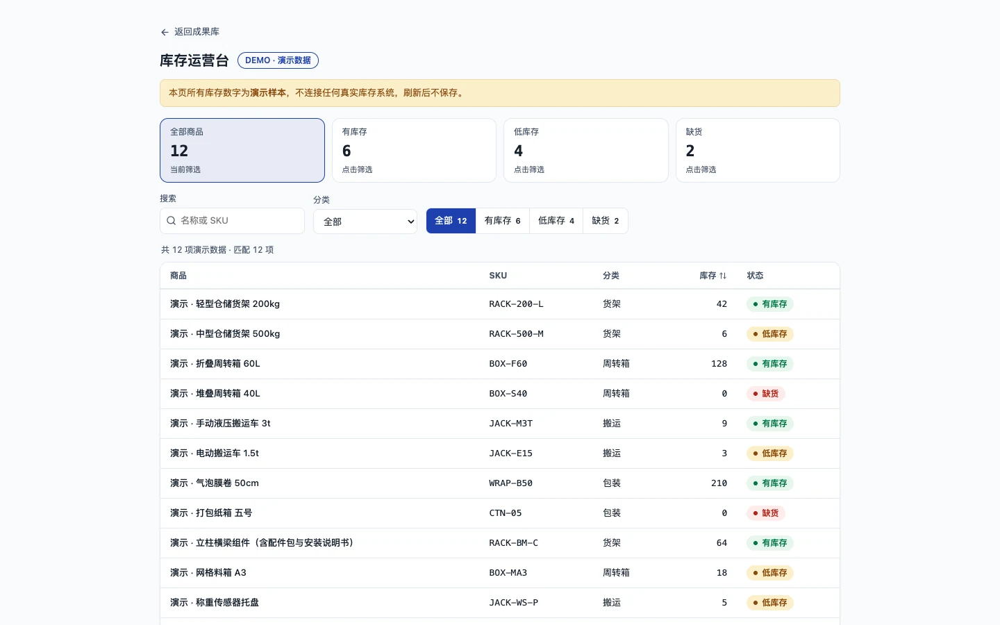

# 库存运营台

用于搜索商品、筛选库存状态和查看商品详情的响应式运营界面。

[快速开始](#本地运行) · [数据边界](#数据边界) · [验证范围](#验证范围)



> 演示库存，不连接真实业务系统。[截图记录](../../docs/readme-media.md)

## 能做什么

- 用商品名称或 SKU 搜索，组合分类和库存状态筛选。
- 查看状态计数、调整库存排序，并通过 URL 恢复筛选条件。
- 打开商品详情，关闭后返回原操作位置。
- 桌面显示表格，窄屏显示商品列表和底部详情面板。

这是既有 `operations-not-marketing` 实验的独立演示副本。历史源码与验收保留在 `evals/runs/operations-not-marketing/`，不随演示构建发布；本次 README 整理没有重新设计应用。

## 数据边界

所有 12 项商品及最近动线都是明确标识的演示样本。不连接真实库存、账户或外部服务；「发起调拨」和「创建盘点」仅显示演示提示，不修改库存。筛选条件保存在当前 URL，可随 URL 恢复；商品库存本身没有持久化。

## 本地运行

使用 Node.js 24，在本目录执行：

```sh
npm ci --ignore-scripts
npm run dev -- --port 5178
```

默认只监听 `127.0.0.1`。端口被占用时指定另一个端口。

```sh
npm test
npm run typecheck
npm run build
```

独立构建使用相对资源路径。成果库集成时由构建命令明确传入路径：

```sh
npm run build -- --base=/ui-design-agent-showcase/demos/inventory-console/
```

「返回成果库」以 Vite 的 `BASE_URL` 为基准上移两级，回到成果库根路径。本目录单独运行时，该链接会指向本地站点根路径；完整导航需在成果库构建中验证。

## 验证范围

单元测试针对库存状态边界、演示数据、搜索/分类/状态组合、稳定排序及 URL 状态读取和序列化。测试和构建通过不等于视觉或无障碍验收；公开路径、键盘和响应式浏览器验证由成果库集成任务另行记录。其他项目（包括积木工作台）的测试数量与验收结论不适用于此演示。

## 发布与许可

反馈时提供商品样例、筛选条件、浏览器和操作步骤，不上传真实库存或客户数据。

公开站点仅部署编译后的 `dist/` 内容，不部署原始 TypeScript、测试、README、配置或历史实验文件。构建不生成 source map，`dist/third-party-licenses.json` 记录打包依赖的第三方许可声明。

演示体验，项目代码未另行授予开源许可证。第三方依赖遵循其各自许可证，不意味着项目源码获得相同许可。
