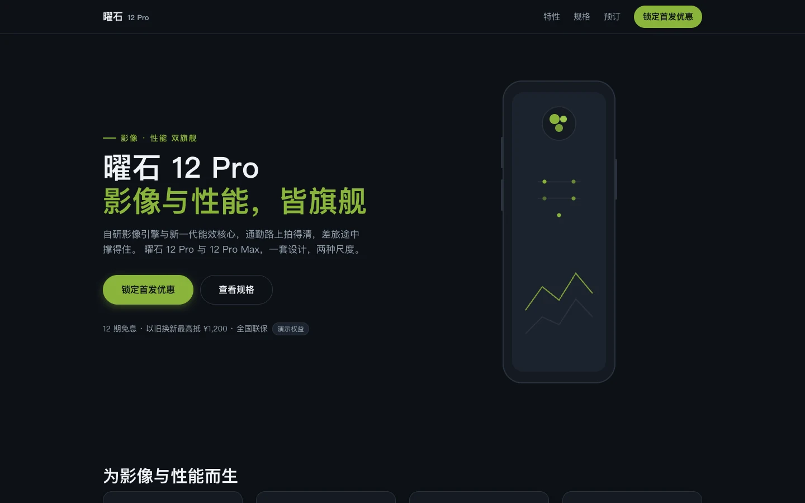

# 曜石 12 Pro

比较两款虚构手机、选择容量与颜色、整理购买意向的交互演示。

[快速开始](#快速开始) · [交互范围](#交互范围) · [数据边界](#数据边界)



> 虚构品牌与产品，不提供购买、预约或支付服务。本项目不是成果展厅里「曜石 X1」历史截图的同名源项目。[截图记录](../../docs/readme-media.md)

## 交互范围

- 比较 Pro 与 Pro Max 的演示规格。
- 切换 256GB、512GB 和 1TB 容量，联动显示演示价格。
- 选择曜石黑、霜白银或翡翠绿，查看当前配置。
- 将配置加入本页意向清单，浏览常见问题。

## 快速开始

推荐 Node.js 24。在仓库根目录运行：

```bash
cd demo/phone-demo
npm ci --ignore-scripts
npm run dev -- --host 127.0.0.1 --port 5181
```

打开终端显示的地址；端口冲突时指定其他端口。

## 数据边界

型号、价格、规格、预约人数和日期都是演示设定，不构成购买要约。意向只存于当前页面内存，刷新即恢复初始状态；没有后台写入、真实库存、订单或付款。

## 验证与维护

```bash
npm run build
```

构建包含 TypeScript 检查，未配置独立 `npm test`。旧的交互检查见[历史验收](ACCEPTANCE.md)，设计依据见[设计契约](DESIGN.md)与[参考记录](research-notes.md)。截图只证明指定画面，不是产品性能证据。

问题反馈请附机型、颜色、容量、操作步骤与浏览器。

## 许可

本项目未单独授予源码许可证。第三方依赖按各自条款使用，参见[第三方声明](../../THIRD_PARTY_NOTICES.md)。
