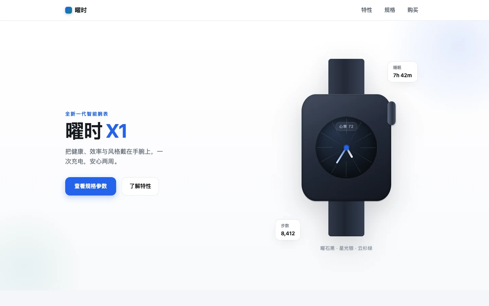

# 曜时 X1

围绕腕表外观、特性和规格组织的虚构产品展示页。

[快速开始](#快速开始) · [展示内容](#展示内容) · [演示边界](#演示边界)



> 前端概念 demo。腕表由页面图形绘制，不是实物照片；品牌、健康数据与硬件参数均为虚构设定。[截图记录](../../docs/readme-media.md)

## 展示内容

- 产品首屏与特性介绍。
- 规格表、锚点导航和窄屏菜单。
- 本页购买意向的前端反馈。

## 快速开始

推荐 Node.js 24。在仓库根目录运行：

```bash
cd demo/product-demo
npm ci --ignore-scripts
npm run dev -- --host 127.0.0.1 --port 5183
```

打开终端显示的地址；端口被占用时换一个端口。

## 演示边界

没有实体商品、健康监测能力、支付、真实订单或云端存储。页面中的续航、防水和传感器描述只是示例内容，不是经过测试的硬件性能或医疗建议。意向按钮仅改变当前页面状态。

## 验证与维护

```bash
npm run build
```

构建包含类型检查，未配置独立 `npm test`。[设计契约](DESIGN.md)与[历史验收](ACCEPTANCE.md)保留原有范围，不因整理 README 自动变成新的测试结论。

报告问题请附浏览器、窗口宽度和操作步骤。

## 许可

未单独授予项目源码许可证，第三方依赖使用各自许可。参见[仓库第三方声明](../../THIRD_PARTY_NOTICES.md)。
