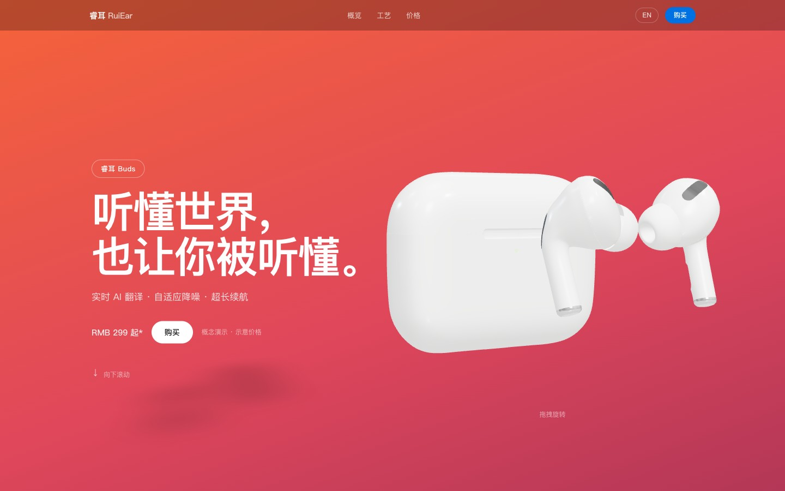
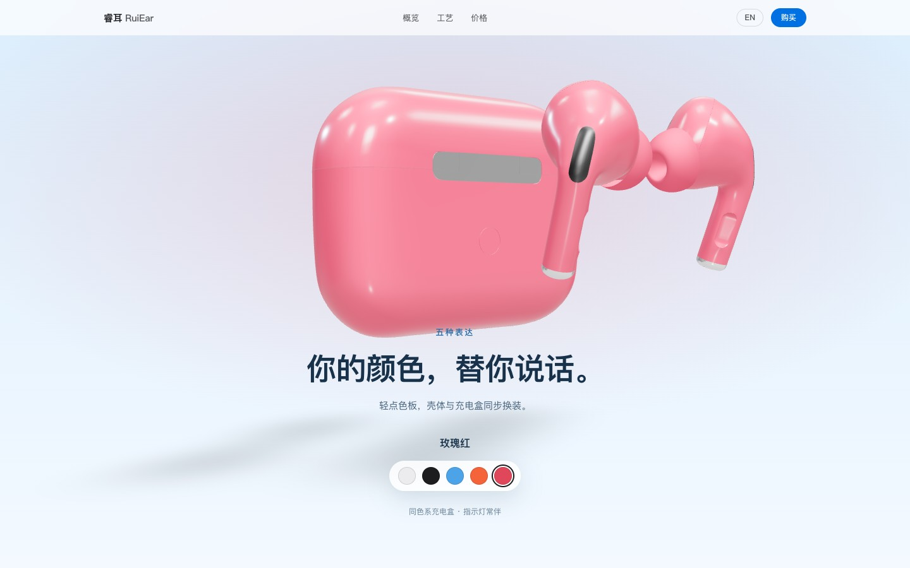
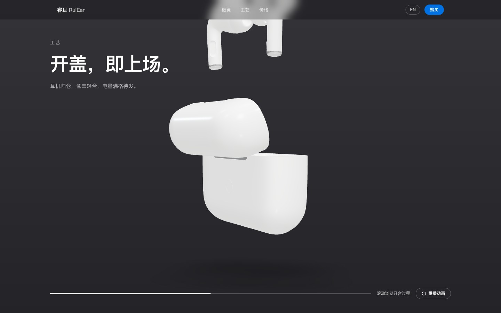
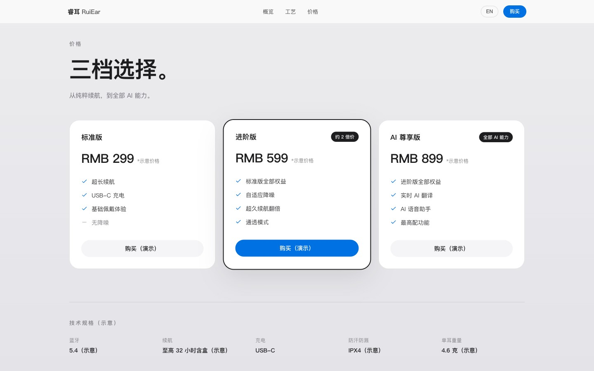
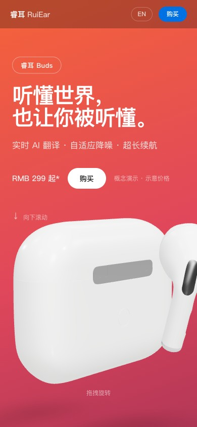

# 睿耳 RuiEar · AI 耳机产品落地页

苹果式极简打底、叠加自有风格的 AI 耳机产品营销单页：真实授权 3D 模型全程在场，
五配色实时换装、滚动刮擦的开合盖动画、中英双语切换。

> 本页为**概念演示页**：品牌「睿数 · 睿耳 RuiEar」为占位品牌，价格与参数均为示意数据。



## 运行

```bash
npm install --legacy-peer-deps   # R3F 的可选 peer（expo 链）需要 legacy 解析
npm run dev                      # 开发 http://localhost:5173
npm run build                    # 产出 dist/
npm run preview                  # 预览生产构建
```

技术栈：Vite 6 · React 19 · TypeScript · Tailwind CSS 4 ·
@react-three/fiber + drei（3D）· Motion（spring 动效）· Lenis（平滑滚动）· lucide-react。

## 能力清单

- **Hero 3D 在场**：授权 GLB 实时渲染，缓慢转台，支持拖拽旋转（桌面）。
- **配色剧场**：radiogroup 五色板（键盘 ←/→ 可操作），切换时壳体材质弹性过渡 + 区块色晕联动。
  五色：月光白 / 午夜黑 / 天空蓝 / 落日橙 / 玫瑰红。
- **AI 功能三屏**：实时翻译 / 自适应降噪 / 超长续航，色调按「顶部鲜艳→下部平淡」旅程推进。
- **3D 工艺叙事**：模型自带的开盖-入仓-合盖烘焙动画，随滚动刮擦播放，附进度条与重播按钮。




- **三档价格**：标准版（续航）/ 进阶版（降噪+翻倍续航，约 2 倍价）/ AI 尊享版（全部 AI 能力），
  全部示意价，诚实标注。
- **中英双语**：导航「中/EN」即时切换全站文案，`localStorage` 持久化，`<html lang>` 同步。
- **可访问性**：色板 radiogroup 键盘操作；`prefers-reduced-motion` 下平滑滚动、色环过渡、
  自动旋转与重播动画全部停用或退化为直接呈现。




## 限制与诚实边界

- 无后端、无真实购买：所有「购买」按钮为演示交互。
- 价格、续航、蓝牙版本、重量等数字均为示意，页面内多处标注。
- 3D 模型来自 Sketchfab 社区（见下方署名），为社区创作而非 Apple 官方资产；
  模型仅含单只耳机展示位（动画原样），双侧佩戴表现以文案示意。

## 授权

- 3D 模型：[AirPods Pro](https://sketchfab.com/3d-models/airpods-pro-3f84ddc3d87a4ec0a5e5f379abfecd9c)
  by Jed Falcone（[CC BY 4.0](http://creativecommons.org/licenses/by/4.0/)）——页脚已署名；
  本项目对其的使用与修改（换色、动画刮擦、场景编排）遵循同一许可。
- 其余代码与版面：本项目自有；图标 lucide（ISC）；参考基线仅作观察研究，未复制任何 Apple 资产。
