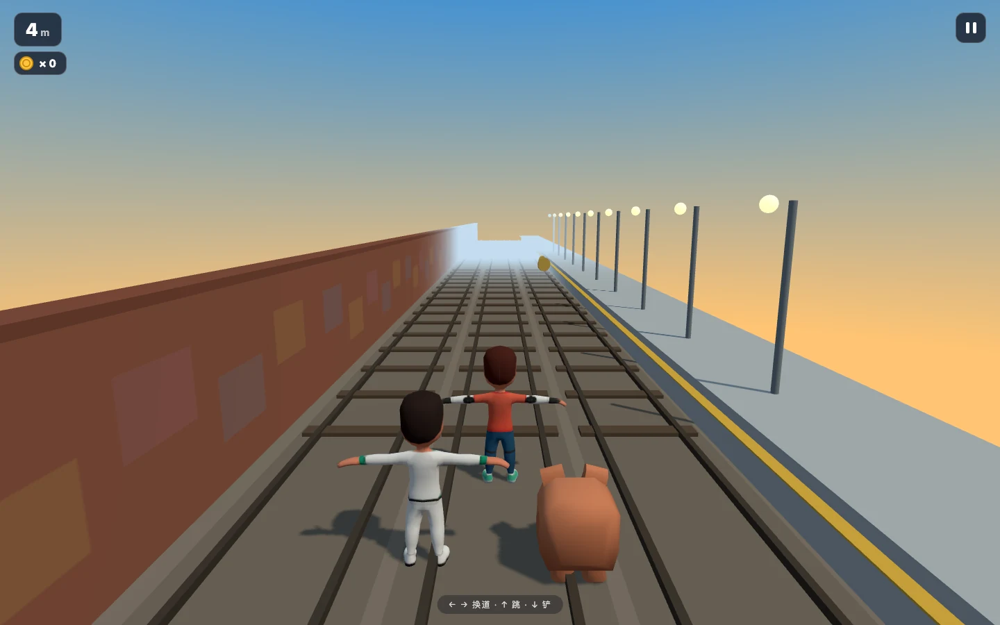

# 地铁跑酷 Subway Dash

在三车道轨道上变道、跳跃和滑铲的浏览器 3D 跑酷游戏。

[快速开始](#本地运行) · [操作与规则](#操作与规则) · [实现结构](#结构)



> 独立游戏 demo，在成果展厅中也标为「地铁疾行」。最佳纪录保存在当前浏览器，不提供账号或在线排行榜。[截图记录](../../docs/readme-media.md)

## 操作与规则

- 键盘方向键或触屏滑动：左右变道、向上跳跃、向下滑铲。
- 躲避低栏、限高门和列车，收集金币。
- 小障碍擦碰后追捕者靠近，再次失误或正面撞车会结束本局。
- 角色和贴图就绪后才允许开始；加载失败时可以重试。

角色与动物来自 Kenney CC0 素材（Animated Characters Protagonists + Cube Pets），
场景为 Three.js 实时渲染（透视相机追尾、实时阴影、雾效）。

## 本地运行

推荐 Node.js 24。在仓库根目录进入本项目：

```sh
cd demo/subway-runner
npm ci --ignore-scripts
npm run dev -- --host 127.0.0.1 --port 5177
```

开发地址以终端输出为准；端口冲突时换一个端口。需要支持 WebGL 2 的现代浏览器。

```sh
npm run build   # tsc --noEmit + vite build → dist/
npm test        # 触屏滑动分类单测（node --test）
```

构建产物为纯静态文件，任意静态服务器指向 `dist/` 即可在线体验，例如：

```sh
python3 -m http.server 4174 --directory dist
```

门C 视觉原型存档在 `dist/prototype.html`（构建自动携带）。

角色和皮肤贴图加载完成后才开放开局；加载失败时，原按钮提供重试。
[`subway-readiness.browser.js`](../../showcase/tests/subway-readiness.browser.js)
可由 Playwright MCP 的 `browser_run_code_unsafe.filename` 在展示站页面执行，
覆盖贴图延迟、失败重试、解码就绪、触屏换道与暂停。它不包含在 `npm test`
的纯逻辑单测中，需另行运行真实浏览器。

## 结构

- `src/engine.ts` — 游戏模型：状态机、弹簧换道、跳跃/滑铲、生成不变量
  （至少一条车道可通行、金币不与障碍重叠）、碰撞与判死、追捕者距离。
- `src/three-env.ts` — Three.js 环境：轨道循环、障碍池、金币池、光照与相机。
- `src/three-actors.ts` — 角色加载与动画（FBX/GLB、换肤、AnimationMixer）。
- `src/input.ts` + `src/swipe.js` — 键盘与触屏滑动（分类器可单测）。
- `public/models/` — Kenney CC0 模型与皮肤（出处见仓库 THIRD_PARTY_NOTICES.md，
  原始包与 License.txt 在 `assets-src/`）。
- `DESIGN.md` / `ACCEPTANCE.md` / `research-notes.md` — 设计契约、验收留痕、
  角色设计参考研究。

## 验证与许可

[历史验收](ACCEPTANCE.md)记录已有浏览器检查，本次文档截图不替代碰撞、触屏和失败重试测试。报告问题时附输入方式、复现步骤和浏览器，不需要提供个人存档。

Kenney 资源声明为 CC0，原始许可随素材保留；其他依赖参见[第三方声明](../../THIRD_PARTY_NOTICES.md)。素材的 CC0 不意味着整个游戏源码获得相同许可，项目未单独提供源码许可证。
