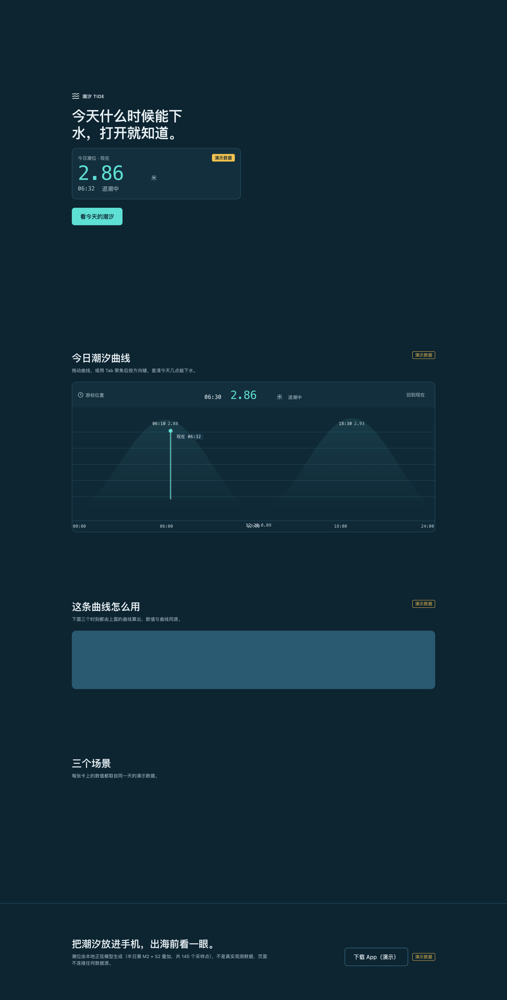
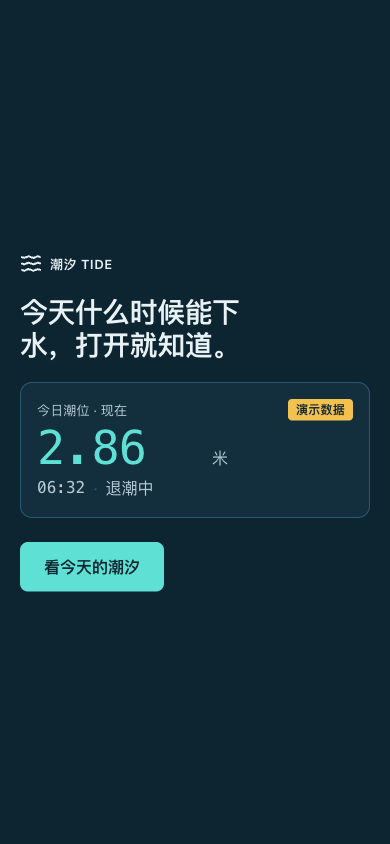

# 潮汐 TIDE

面向海钓与赶海人群的潮汐读数产品页。首屏直接给今日潮位读数，配一条可用键盘或手指拖动的时间轴曲线。





> **演示数据**：页面上的潮位是本地生成的半日潮模拟数据，**不是真实潮汐预报**。页面上所有「预报」字样旁均标注演示数据。

## 运行

```bash
npm ci
npm run dev      # 开发服务（127.0.0.1）
npm run build    # 类型检查 + 生产构建
npm test         # 单元测试（46 项）
```

Node.js ≥ 20.18.1。

## 这个项目是怎么做出来的

本项目是一次**完整链路的实跑样本**，用来检验工作流本身。全部过程记录在 `docs/`：

| 文件 | 内容 |
| --- | --- |
| `docs/DIRECTION.md` | 阶段 1 · 方向稿（视觉基调、结构草案、动效意图） |
| `docs/GATE-A-DECISION.md` | 门A 裁决：通过 + 4 项强制修正 A1–A4 |
| `docs/RESEARCH-NOTES.md` | 阶段 2 · 素材候选清单（分类、授权、可达性实测） |
| `docs/reference/OBSERVATION-tideguide.md` | R3 同类产品的浏览器实地观察 |
| `docs/GATE-B-DECISION.md` | 门B 裁决：通过 + 3 项强制要求 B1–B3 |
| `docs/DESIGN.md` | 阶段 3 · 设计契约（375 行，含 QG1–QG24 质量门） |
| `docs/GATE-CD-DECISION.md` | 门C/D 裁决：通过 + 3 项要求 D1–D3 |
| `docs/ACCEPTANCE.md` | 阶段 5 · 验收记录（含**未验证项清单**） |
| `docs/workflow/*.html` | 各阶段的工作流状态图（可交互） |

## 关键决策与依据

**底色 `#0d2431`，正文对比度 13.94:1。** 方向稿原本定 `#071a24`，被门A 否决——户外强光下过暗底色会反光成镜面。全部色值在契约中逐一计算，包括次要文字（最紧一格 7.56:1）。

**只借鉴关系，不照搬色值。** 参考基线取自第三方对公开网站 CSS 的分析（MIT），但实测发现其色值不可用：`linear` 的 `#010102` 亮度远低于下限、其次要文字仅 6.42:1；`vercel` 实为浅色系统而非深色基线。因此只取「单一强调色只用于数据」「四级 surface 阶梯」这些结构关系。

**曲线自绘，不引图表库。** 时间轴用原生 `input[type=range]`（视觉隐藏但保留可聚焦性，用 `opacity:0` 而非 `display:none`），从而天然获得键盘操作与无障碍支持。

**第三屏不解释潮汐原理。** 实地观察同类产品后发现，其官网默认访客已经知道潮汐是什么。目标用户是海钓的人，第三屏改为展示**基于真实读数的判断**（如"退潮前两小时适合赶海"）。

## 验证状况

- `npm test` 49/49 通过；`npx tsc --noEmit` 通过
- 契约质量门静态检查 **14/14 通过**（`node scripts/check-contract.mjs`）
- 浏览器实测：首屏读数可见（375/1440 两档）、键盘可操作时间轴、焦点环 2px `#5ee0d4`、8 个可交互元素全部 ≥44px、减少动效下运行中动画为 0

**验证入口**：`?state=loading` 与 `?state=empty` 用于核对契约要求的加载态与空态。它们是**验证入口，不是产品功能**——默认路径直接渲染读数，不会出现加载态。

**未验证项**（如实列出，见 `docs/ACCEPTANCE.md` 第四节）：动效中断与反转、200% 文字缩放、320px 与 768px 断点、无 SF Mono 环境的字体回退、自动化无障碍审计、曲线加载/空态在浏览器中的触发、场景卡七态逐一触发。

**已知风险**：时间轴用 `touch-action: none`（契约允许），意味着 375px 下手指落在曲线上时页面不滚动。对戴手套的海钓用户可能不便，已登记待观察。

**实现期对契约的修正**：契约的潮位公式缺基准面常数项，会导致负值；实现补了 `1.50`（见 `docs/IMPLEMENTATION-DECISIONS.md` 第 1 条，契约已同步补注）。

## 素材与授权

- 图标：`lucide-react`（ISC），沿用仓库既有依赖
- 动效：`motion`（MIT）
- 字体：纯系统字体栈，无外部字体
- 参考基线：第三方 CSS 分析文档（MIT），**只取结构关系，不复制其内容或色值**；同类产品（Tide Guide）仅作 reference，其素材、文案、配色一律未使用

## 已知限制

- 潮位为模拟数据，不可用于真实出海决策
- 无账号系统、无后端、无真实数据源接入
- 单页；不含多语言
