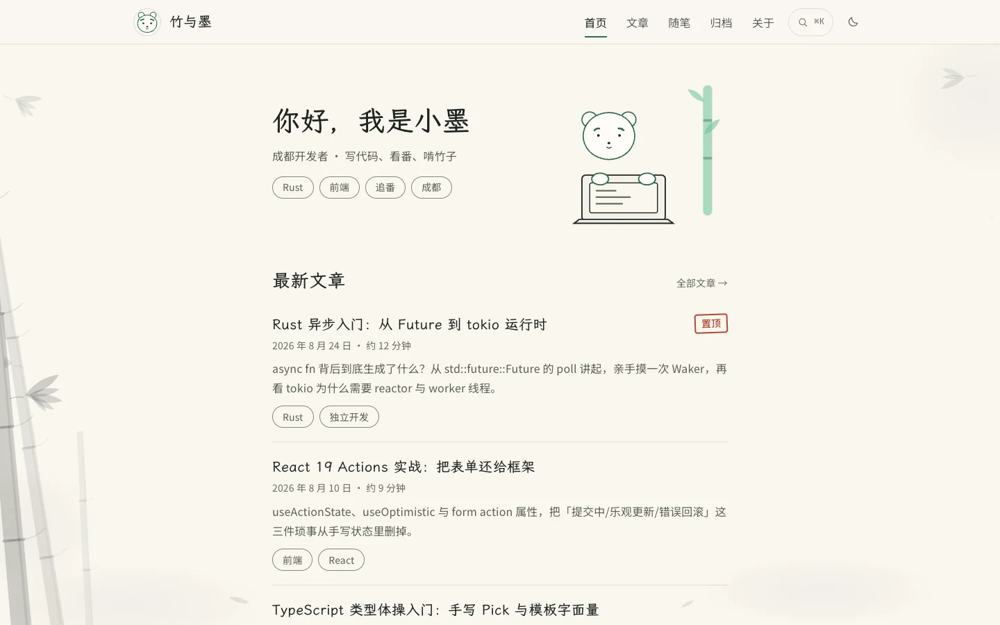

# 竹与墨

以文章阅读为中心，将水墨视觉融入导航、搜索和阅读反馈的技术博客演示。

[快速开始](#快速开始) · [可体验内容](#可体验内容) · [历史记录](docs/implementation-notes.md)



> 虚构作者「小墨」的博客 demo。文章、随笔、人物与联系方式都是演示数据。[截图记录](../../docs/readme-media.md)

## 可体验内容

- 浏览技术文章、随笔、归档和作者介绍。
- 进入文章详情，使用目录与代码块复制。
- 使用搜索、标签筛选和主题切换。
- 在窄屏使用底部导航，观察加载、空状态和重试反馈。

## 快速开始

推荐 Node.js 24。在仓库根目录运行：

```bash
cd demo/zhumu-blog
npm ci --ignore-scripts
npm run dev -- --host 127.0.0.1 --port 5185
```

打开终端显示的地址。端口被占用时换一个端口。

```bash
npm run build
npm run preview -- --host 127.0.0.1
```

部署时需要为 BrowserRouter 提供单页应用路由回退，否则直接访问文章详情可能返回 404。字体通过 CDN 加载，离线时使用本机回退字体。

## 数据与已知限制

没有 CMS、作者账号、评论后台或真实内容同步。部分加载失败与空状态是为了展示交互而预设的情境。

真机下拉/上拉手感、完整对比度检查、字体传输预算和性能评分仍有未完成项，见[历史实现记录](docs/implementation-notes.md)。本次 README 配图不改变这些限制。

## 验证与资料

`npm run build` 包含 TypeScript 检查；未配置独立 `npm test`。

[设计契约](DESIGN.md) · [实现与自查记录](docs/implementation-notes.md) · [插画来源](public/irasutoya/SOURCE.md)

报告问题时附路由、主题、浏览器和输入方式。不要把虚构联系方式当成实际客服入口。

## 许可与致谢

插画使用いらすとや的条件制条款，字体各有许可证，详见[历史授权记录](docs/implementation-notes.md#授权与致谢)及[第三方声明](../../THIRD_PARTY_NOTICES.md)。项目没有单独授予源码开源许可证，第三方素材的许可不代表整个项目可任意再分发。
