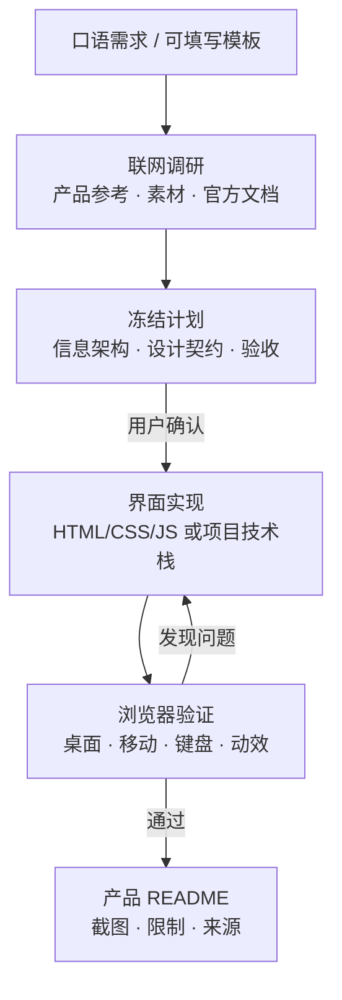

# UI Design Agent Kit：让 AI 先学最好的界面，再交付有证据的产品

<div align="center">


<sub>真实浏览器截图：工作流成果展厅。这不是概念图，是本地构建后的实际页面。</sub>

</div>

---

> 一句话介绍：**UI Design Agent Kit 是一套把“口语需求”变成“可验收界面”的项目级 AI 工作流。**
> 它不替你做决定，而是先联网找参考，再冻结计划，等你确认后才实现，最后用真实浏览器留下证据。

## 我为什么做它

很多人把 AI 设计界面理解成“输入一句话，马上吐一屏 UI”。这条路看起来快，实际上很危险：需求没有边界，设计没有依据，素材没有授权，结果没有验收。

我的核心理念更直白：

> **AI 擅长模仿和摘抄，不擅长凭空发明一个真正成熟的产品。**

所以这套工作流不是鼓励 AI“从零硬造”，而是强迫它先看清楚：这个任务应该参考谁？哪个页面解决了类似问题？哪些素材可以用？哪些交互已经被验证过？确认这些之后，AI 才能站在可靠经验上做适配和实现。

换句话说，**它不是偷懒的生成器，而是一个有研究纪律、设计契约和验收闭环的工作台。**

## 它解决什么问题

| 常见问题 | UI Design Agent Kit 的做法 |
| --- | --- |
| 用户只会说“帮我做个好看的页面” | 把口语需求整理成目标、范围、关键问题、组件清单和完整开发提示词 |
| AI 直接开工，方向错了也停不下来 | 先输出冻结计划，用户确认后才进入实现 |
| 生成结果像“AI 风” | 先联网查找产品参考、官方文档、设计系统和素材，再模仿其结构与品质 |
| 素材来源不明，不敢商用 | 记录来源、用途、访问时间、授权边界；未确认授权的素材不进入实现 |
| 只给代码，不给结果 | 用真实浏览器检查桌面、移动、键盘、错误态和减少动效，并保留截图 |
| 项目越做越散 | 每个产品都有自己的 README，记录功能、截图、运行方法、限制与验证 |

## 工作流怎么跑



你只需要给出这样的开始：

```text
$ui-design-agent 我想把采购申请集中起来，看谁还没处理。先整理第一版需求，由你联网找参考，再给我完整开发提示词，先不要开发。
```

如果暂时不知道怎么描述，也可以使用仓库里的可填写模板：  
[需求初始模板](https://github.com/muzimu217/ui-design-agent-kit/blob/main/.agents/skills/ui-design-agent/references/plan-execute.md#initial-request-template)

## 已做出的成果

这些不是 Photoshop 排出来的宣传图，而是本地构建后用真实浏览器截图的页面。

<table>
<tr>
<td width="50%">


<p align="center"><sub>库存运营台：列表、详情和演示数据</sub></p>

</td>
<td width="50%">


<p align="center"><sub>Tempo 今日节奏：任务管理与专注计时</sub></p>

</td>
</tr>
<tr>
<td width="50%">


<p align="center"><sub>积木小工坊：3D 自由拼搭与小挑战</sub></p>

</td>
<td width="50%">


<p align="center"><sub>NODEGRID：虚构云节点网络可视化</sub></p>

</td>
</tr>
</table>

目前仓库里已经收录 11 个不同方向的案例，包括库存工具、任务管理、3D 拼搭、网络可视化、3D 跑酷、手机官网、腕表展示、博客阅读和水墨风站点。  
完整列表见：[产品案例](https://github.com/muzimu217/ui-design-agent-kit#产品案例)

## 和“直接问 AI 写页面”有什么不同

普通对话生成通常是这样：

> 用户描述 → AI 猜测 → 直接写代码 → 用户看到一屏结果

UI Design Agent Kit 是这样：

> 用户描述 → 联网研究 → 提出计划 → 用户确认 → 按契约实现 → 浏览器验证 → 修复问题 → 写产品 README

差别不在于“多走几步”，而在于每一步都有明确的交付物：

1. **需求阶段**交付范围和待确认问题；
2. **调研阶段**交付参考、素材候选和授权状态；
3. **计划阶段**交付可冻结的开发提示词；
4. **实现阶段**交付界面与交互；
5. **验收阶段**交付真实截图、已知问题和限制说明。

## 快速开始

需要 Node.js 20.18.1+、npm，以及能读取项目指令和技能的 AI 宿主。

```bash
git clone https://github.com/muzimu217/ui-design-agent-kit.git
cd ui-design-agent-kit

npm ci --ignore-scripts
npm run verify
npm test
```

然后在项目会话里用 `$ui-design-agent` 开始需求。

仓库地址：  
[https://github.com/muzimu217/ui-design-agent-kit](https://github.com/muzimu217/ui-design-agent-kit)

## 它适合谁

适合三类人：

- **产品 / 独立开发者**：想把模糊需求快速整理成可执行方案，再让 AI 实现。
- **前端 / 设计工程师**：希望 AI 不是乱造风格，而是基于参考和设计契约工作。
- **团队内部工具探索者**：需要快速产出演示界面、产品页、控制台或营销原型。

它不适合那些想“完全无人监督，一键变成商业系统”的场景。这个项目的价值不是省掉判断，而是把判断放在正确的位置。

## 诚实边界

这是一个开源 demo 和工作流验证，不是万能产品工厂。

- demo 与 showcase 是教学、验收和宣发案例，不代表所有生成任务都已经完成商业验收。
- 主工具包不提供模型服务、账户、付费素材或后台业务接口。
- 联网、浏览器和生图能力取决于当前 AI 宿主的实际工具，不因安装提示词自动出现。
- 截图只证明对应页面的当次检查，不等于全流程性能、无障碍或生产部署验收。

## AI 生图素材需求

下面这些图用于文章封面和章节分隔。请把生成结果保存为
`showcase/products/media/promotion/` 下的对应文件名，然后替换本文档里的占位链接。

| 文件名 | 用途 |
| --- | --- |
| `cover.png` | 主封面 |
| `mimicry.png` | 核心理念概念图 |
| `workflow-panels.png` | 四格工作流图 |

### 1. `cover.png`：主封面

- **图片素材**：宽幅科技感工作台俯视图，桌面上有草图、浏览器窗口、代码窗口、设计稿和界面截图。
- **提示内容**：一个理性的 AI 设计工作流，从口语输入到研究、设计、实现和验收。
- **生成要求**：1920x1080，横向构图，左侧留出标题空间，颜色以深灰、浅米、蓝绿为主，禁止乱码文字，不要出现真实品牌 logo。

```text
Wide top-down tech workspace, 1920x1080, sketch paper, browser window, code editor, design tokens, UI wireframes and verified interface screenshots arranged as a calm research-to-delivery workflow. Muted dark gray background, light paper texture, teal and blue-green accents, crisp modern editorial style, no readable text, no brand logos, no people faces, high clarity, generous left-side negative space for a title.
```

### 2. `mimicry.png`：“AI 擅长模仿，不擅长凭空创造”概念图

- **图片素材**：一条从多个参考图纸汇入中央模型的抽象流线，中央模型再输出一个统一界面。
- **提示内容**：成熟经验进入工作流，最终变成有边界的产品。
- **生成要求**：1920x900，抽象但克制，线条清晰，不要赛博朋克霓虹，不要复杂粒子爆炸。

```text
Abstract editorial infographic, 1920x900, several refined reference sheets flowing into a central quiet machine, then one coherent user interface flowing out. Clean vector-like geometry, soft teal, warm gray and off-white palette, clear directional lines, calm systematic mood, no readable text, no logos, no glitch effects, no neon cyberpunk colors, generous white space.
```

### 3. `workflow-panels.png`：需求 → 研究 → 计划 → 验收

- **图片素材**：四个连续场景，分别表示口语输入、联网查资料、冻结计划、浏览器验收。
- **提示内容**：用户一句话进入，AI 用研究和验证把结果变可靠。
- **生成要求**：1920x1080 或 2x2 分格，每格视觉重点单一，适合社区文章，不要乱码文字。

```text
Four-panel editorial illustration, 1920x1080, showing a spoken request, a research pass over documents and references, a frozen structured plan, and a browser-based interface verification session. Consistent flat modern illustration style, teal and slate palette, subtle paper texture, clean shapes, no readable text, no logos, no real product screenshots, balanced composition suitable for a technical blog.
```

## Linux.do 首贴短稿

以下内容可直接复制到社区首贴；图片先上传，再替换占位。

### 标题

```text
UI Design Agent Kit：让 AI 先学最好的界面，再交付有证据的产品
```

### 正文

```markdown
很多人把 AI 做界面理解成“一句话直接吐代码”。我做了另一条路：

**先联网研究，再冻结计划，用户确认后才实现，最后用真实浏览器验收。**

我的核心理念是：AI 更擅长模仿、摘抄和适配成熟经验，而不是凭空发明一个成熟产品。所以 UI Design Agent Kit 要求 AI 先找参考、看清结构、确认素材和授权边界，再进入实现。

它交付的不是“一屏看起来不错的结果”，而是：

1. 需求摘要和可执行开发提示词
2. 参考来源、素材候选和授权边界
3. 可冻结的设计契约
4. 真实浏览器截图和产品 README


仓库：
[https://github.com/muzimu217/ui-design-agent-kit](https://github.com/muzimu217/ui-design-agent-kit)

本地启动：

```bash
git clone https://github.com/muzimu217/ui-design-agent-kit.git
cd ui-design-agent-kit
npm ci --ignore-scripts
npm run verify
npm test
```

注意：这是一个开源 demo 和工作流验证。它不提供模型服务、账户、付费素材或后台接口；截图只代表对应页面的当次检查。

欢迎反馈三件事：需求能否被整理清楚？参考查找是否真的影响界面质量？README 是否让你知道成果可靠在哪里？
```

## 推荐发布顺序

1. **先生成主封面和概念图**，确保文章首屏不像纯代码仓。
2. **替换本文档图片占位**，并确认真实截图路径仍然有效。
3. **在 GitHub README 中加一条指向本文档的入口**，方便社区读者回到完整版本。
4. **发布到社区时压缩介绍长度**，保留封面、核心理念、三张成果图、快速开始和仓库链接。
5. **在评论区补充案例细节**，不要在首贴里把所有项目一口气塞满。

## 反馈方向

如果你愿意试用，最欢迎三类反馈：

1. 你给出的需求能否被整理成一个清晰的计划？
2. 参考和素材查找是否真的影响到了最终界面质量？
3. 产品 README 的边界说明是否让你知道“这个成果可靠在哪里，不可靠在哪里”？

GitHub Issues：  
[https://github.com/muzimu217/ui-design-agent-kit/issues](https://github.com/muzimu217/ui-design-agent-kit/issues)
