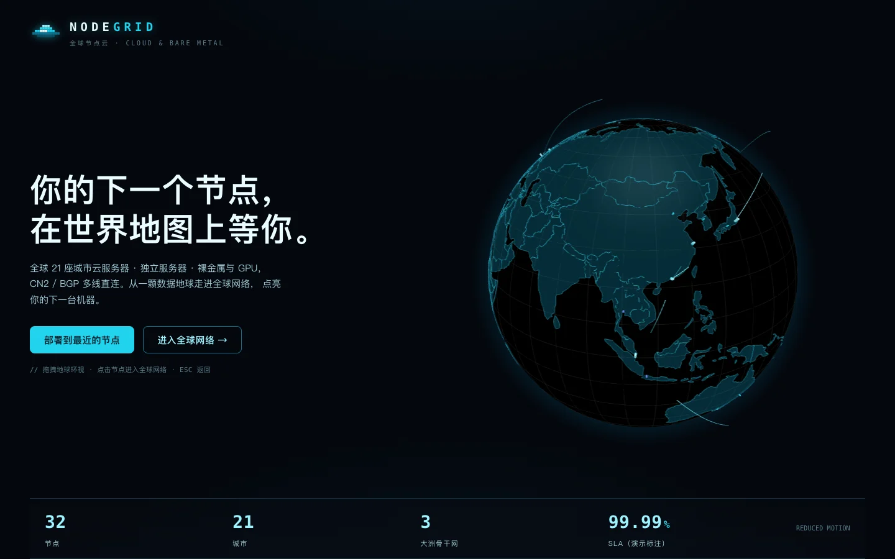
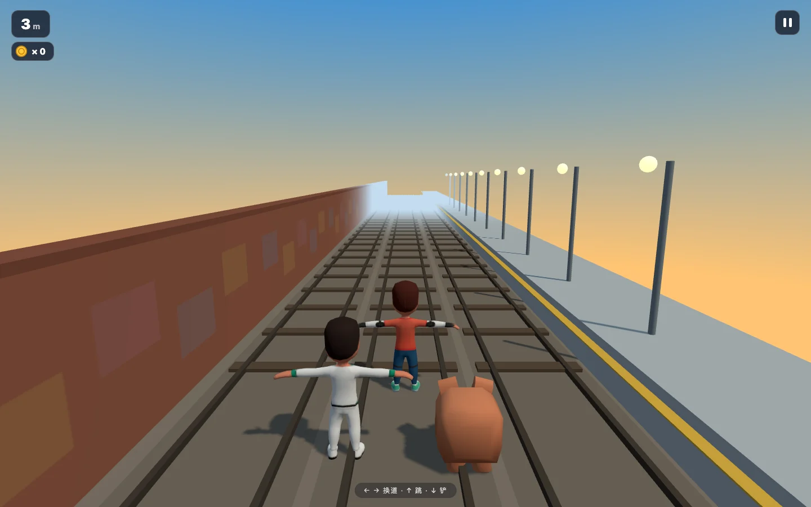

# Public Beta Release · 2026-09-08

主产品是 UI Design Agent Kit 工作流；积木、库存、NODEGRID 和地铁疾行是
工作流产出的可玩 demo，不代表每个案例都接入了真实业务或真实云服务。

## Published

- Showcase: <https://agent.kcos.club/>
- Brick workshop: <https://agent.kcos.club/demos/brick-workshop/>
- Inventory console: <https://agent.kcos.club/demos/inventory-console/>
- NODEGRID: <https://agent.kcos.club/demos/nodegrid/>
- Subway Dash: <https://agent.kcos.club/demos/subway-runner/>
- Public feedback and submissions: <https://github.com/muzimu217/ui-design-agent-showcase>

GitHub Pages is configured for `agent.kcos.club` with an approved certificate,
HTTPS enforcement, and Cloudflare DNS-only CNAME `agent -> muzimu217.github.io`.
The published manifest uses `basePath: "/"`, contains five entrypoints and 55
files, and its SHA-256 inventory was rechecked after deployment. The deployed
release is the `be904ee` commit. Later documentation-only commits update release
materials without rebuilding the application artifact.

## Evidence

The following screenshots were captured from the live `be904ee` release on
`agent.kcos.club` at 1440 x 900 and 390 x 844. They use reduced motion and fixture
data. Selected stable frames were converted locally to WebP at quality 86 and
committed with this record; original PNGs remain in `test-artifacts/browser/`.
Existing card imagery and provenance remain in `showcase/products/media/` and
its `SOURCES.md`. Screenshots show rendered states, not complete acceptance of
the Agent workflow or all product behaviors.

Mobile captures: [NODEGRID](media/2026-09-08-nodegrid-mobile.webp) and
[Subway Dash](media/2026-09-08-subway-mobile.webp).

## Checks

- `npm test`: 26/26 passed.
- `demo/subway-runner/npm test`: 5/5 passed.
- Showcase publication boundary: 9/9 passed.
- GitHub Actions run `34237168554`: build and deploy succeeded; brick 125,
  inventory 22, subway 5 and publication boundary 9 checks passed in CI.
- Browser: 375, 390, 768 and 1440px NODEGRID canvas bounds passed with reduced
  motion; NODEGRID map search/detail and Escape close passed; subway models,
  skin textures, keyboard, touch lane change and pause passed.
- HTTP redirects to HTTPS; strict TLS verification reports subject
  `agent.kcos.club` and TLS 1.3.

## Remaining Limits

- P2: dense neighboring NODEGRID nodes overlap in the full-world view. Searching
  a node ID allows reliable selection; a clustering interaction is not included.
- Browser evidence is Chromium desktop/mobile emulation, not a real-device GPU
  performance study, Safari certification, or an Agent-behavior evaluation.
- Phone and blog cases remain screenshot-only in this release. No Remotion video
  or additional product route is claimed.

## Public Testing Boundary

Demo experience is open to everyone. Workflow execution tests require access to
the relevant source, skills, models and services. Feedback should include the
URL, release/version, environment, shortest reproduction steps, expected result,
actual result, and optional sanitized screenshot. Do not submit credentials,
private prompts, customer data or private code.
